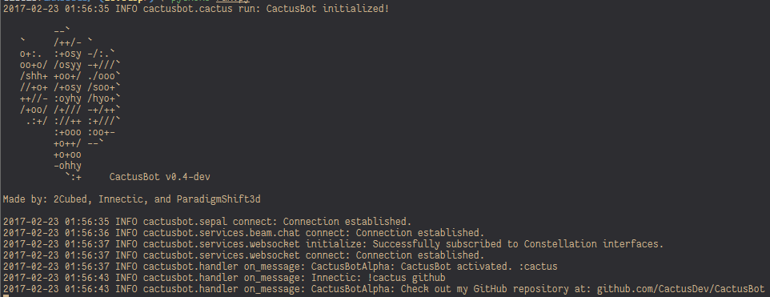

# CactusBot

CactusBot is a next-generation ChatBot for LiveStreams.
Harnessing the power of open-source, and extraordinary community to shape its path



# Installation

## LINUX:
***PYTHON 3.5 OR GREATER IS REQUIRED. ANY VERSION LOWER IS NOT SUPPORTED***

## Setup Sepal:

Sepal is the backend service that sends packets when the database updates
so the bot can update dynamic values, like the spam config.

## PreInstall

Sepal requires [NodeJS](nodejs.org) (6 or higher), [RethinkDB](rethinkdb.com), and [Redis](redis.io)


```
git clone https://github.com/CactusDev/Sepal
cd Sepal
npm i -g typescript
npm i
```

Next, open `src/configs/default.ts` and fill out all the fields.


## Setup CactusAPI:

CactusAPI controls all the configurable elements of the bot. From commands, to quotes, to the spam config

```
git clone https://github.com/CactusDev/CactusAPI
cd CactusAPI
cp config-example.py config.py
```

Next, open `config.py` in your favorite editor, and adjust `OAUTH_CREDENTIALS` to contain
services for the platforms that your instance will run on.

Example:

```python
OAUTH_CREDENTIALS = {
    "beam": {
        "CLIENT_ID": "SuperCoolClientIDFromBeamsDevLab",
        "CLIENT_SECRET": "SuperCoolClientSecretFromBeamsDevLab"
    }
}
```

Next, set `RDB_DB`, `RDB_HOST`, and `RDB_PORT` to your rethink config.

Next, change `SECRET_KEY` to something secure.

Example:

```python
SECRET_KEY = "bUDWSNJQ8h39tWO72dC9HA5TWorLE2"
```

Next, change `AUTH_EXPIRATION` to the amount of time that you would like an authentication
key to last for.

If we wanted it to last for 1 day, 4 hours, 25 minutes, and 7 seconds:

```python
AUTH_EXPIRATION = {
    "days": 1,
    "hours": 4,
    "minutes": 25,
    "seconds": 7
}
```

Next, install the dependencies.

```
pip3 install -r requirements.txt
```

Next, run `python3 run.py -c` to create all the tables needed.

Finally, create a user in the API with a post request that contains the following data

```json
{
    "service": "beam",
    "token": "username",
    "userId": 58396, // This should be the user id from the service's api
    "password": "supercoolpasswordhere"
}
```

## Setup CactusBot:
```
git clone https://github.com/cactusdev/cactusbot
cd cactusbot
pip3 install -r requirements.txt
cp config.template.py config.py
```

Next, open `config.py` with your favorite text editor, and set 
`USERNAME` and `PASSWORD` to the bots login info, and set `CHANNEL` to your channel's name.

# Usage

Start Sepal:

`npm start`

Start CactusAPI:

`python3 run.py`

Start CactusBot:

`python3 run.py`

# Authors

2Cubed - [@2Cubed](twitter.com/2CubedTech)

Innectic - [@Innectic](twitter.com/Innectic)

ParadigmShift3d - [@ParadigmShift3d](twitter.com/ParadigmShift3d)

# Releases

## 0.3.6:

#### Released: Oct, 1st, 2016
#### [View](https://github.com/CactusDev/CactusBot/releases/tag/v0.3.6) 

### Fixed
 - Friend command regex (again)

### Added
 - Constellation support

### Removed
 - Liveloading

## 0.3.5:

#### Released: September, 2st, 2016
#### [View](https://github.com/CactusDev/CactusBot/releases/tag/v0.3.5) 

### Fixed
 - `!friend` command regex
 - Websocket reconnections
 - Deleting own links

### Removed
 - Unused statistics

## 0.3.4:

#### Released: July, 31st, 2016
#### [View](https://github.com/CactusDev/CactusBot/releases/tag/v0.3.4) 

### Fixed
 - Beam CSRF token usage.
 - Message removal
 - `!repeat` command

## 0.3.3:

#### Released: July, 21st, 2016
#### [View](https://github.com/CactusDev/CactusBot/releases/tag/v0.3.3) 

### Added
 - Documentation is in the bot now

### Fixed
 - Repeat command
 - Cube command crashing when no arguments are present
 - Social command

## 0.3.2:

#### Released: July , 16th, 2016
#### [View](https://github.com/CactusDev/CactusBot/releases/tag/v0.3.2) 

### Added
 - ADD: User loading into the database on bot start
 - ADD: Hosting alerts

### Fixed
 - Exponential-backoff for chat connections
 - Liveloading connection now only happens once
 - Follow alerts spam
 - `spamprot` command crashing when no arguments are present
 - Friend command not allowing for `@`

### Changed
 - `silent` is now `quiet`

## 0.3.1:

#### Released: April, 10th, 2016
#### [View](https://github.com/CactusDev/CactusBot/releases/tag/v0.3.1) 

### Added
 - Uptime command
 - Multi-message responses using `\n`
 - `beam` as a social argument

### Fixed
 - Ghost columns in the database
 - Autorestart conditions
 - `repeat` crash on command removal
 - Whispered responses
 - Message removal

### Changed
 - Command prefix limit to 1

## 0.3.0:

#### Released: April, 9th, 2016
#### [View](https://github.com/CactusDev/CactusBot/releases/tag/v0.3) 

### Added
 - Repeating commands
 - Following and subscriptions notifications
 - User permissions for custom commands
 - Command line arguments for `silent` and `debug`

### Fixed
 - Reconnection spam
 - Random disconnections
 - `!cube`ing emotes

### Changed
 - Move from `asyncio` to `tornado`

## 0.2.1:

#### Released: March, 27th, 2016
#### [View](https://github.com/CactusDev/CactusBot/releases/tag/v0.2.1) 

### Fixed
 - Spam protection command

### Disable
 - Statistics tracking

### Added
 - `autorestart` to config

## 0.2.0:

#### Released: March, 27th, 2016
#### [View](https://github.com/CactusDev/CactusBot/releases/tag/v0.2) 

### Added
 - Command permissions
 - Spam protection

### Changed
 - Config organizations

## 0.1.0

#### Released: March, 5th, 2016
#### [View](https://github.com/CactusDev/CactusBot/releases/tag/v0.1) 

### Added
 - Custom commands
 - Quotes
 - Social command
 - Response targets
