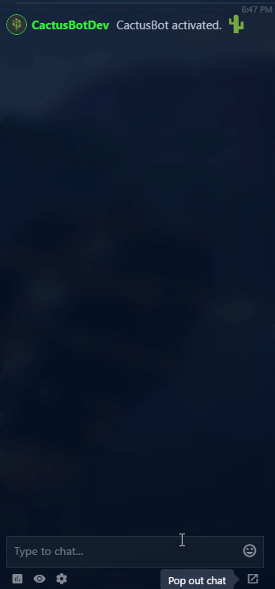

# CactusBot

CactusBot is a next-generation chat bot for live streams.
Harnessing the power of open-source, and extraordinary community to shape its path

## CactusBot in action

# Installation

*PYTHON 3.5 OR GREATER IS REQUIRED. ANY VERSION LOWER IS NOT SUPPORTED.*

[Sepal Setup](https://github.com/cactusdev/sepal)

[CactusAPI Setup](https://github.com/cactusdev/cactusapi)

[CactusBot Setup](INSTALL.md)

# Authors

2Cubed - [@2Cubed](https://twitter.com/2CubedTech)

Innectic - [@Innectic](https://twitter.com/Innectic)

ParadigmShift3d - [@ParadigmShift3d](https://twitter.com/ParadigmShift3d)

# Releases

You can view the changelog [here](CHANGELOG.md)!
